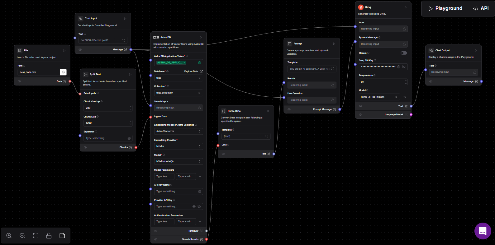
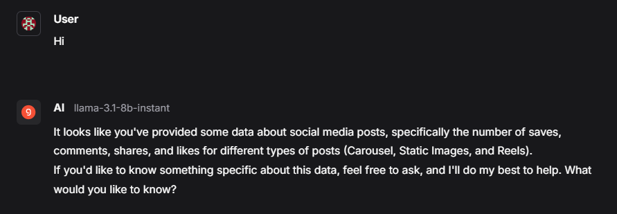
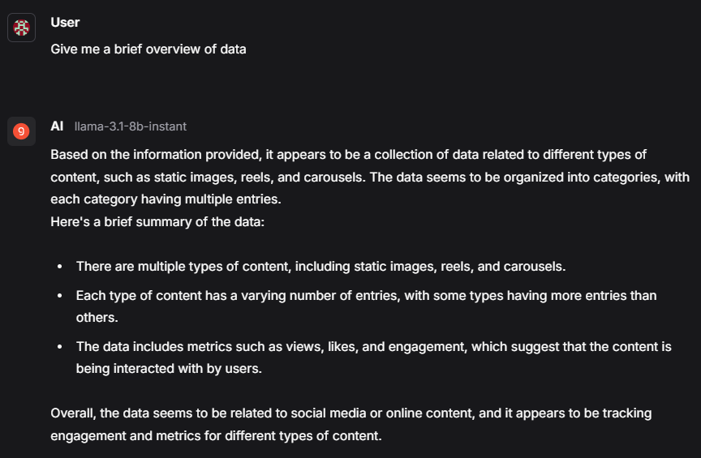
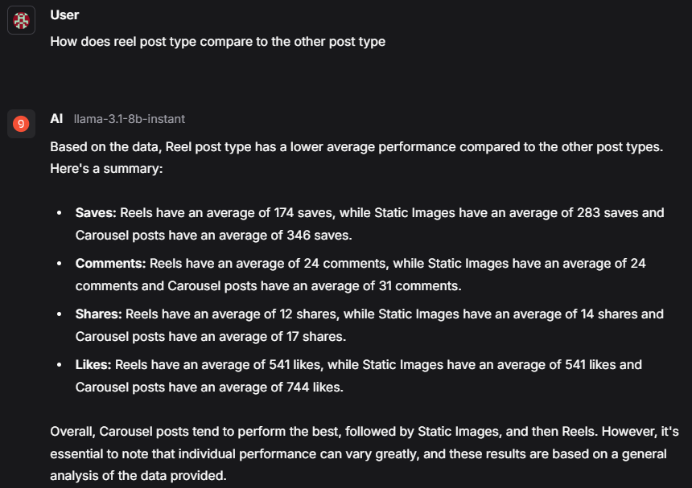
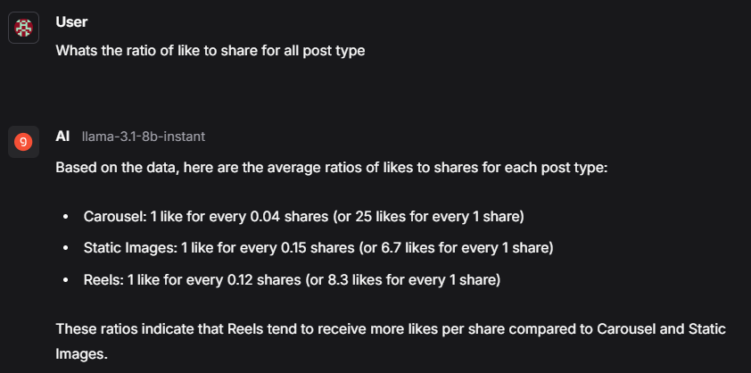

# SocialPulse

SocialPulse is an analytics tool that leverages Langflow and Astra DB to provide easy-to-understand analysis of datasets. The flow, named `SocialPulse_flow`, uses the Groq API to process and interpret data, providing users with meaningful insights.

## Overview
The `SocialPulse_flow` is built using the following components and logic:

1. **Load File**
   - Uploads a dataset (e.g., `data.csv`).
2. **Split Text into Chunks**
   - Splits the inputted file into manageable chunks for processing.
3. **Chat Query**
   - Takes chat input from the user as a query.
4. **Astra DB Component**
   - Stores the text chunks in an Astra DB database.
   - Uses Astra Vectorize (NVIDIA as the provider) for searching and retrieves relevant results.
5. **Parse Data Component**
   - Parses the search results for easier processing.
6. **Custom Prompt Component**
   - Uses the following prompt:
     ```
     You are an AI assistant. A user has asked the following question:
     {UserQuestion}

     Based on the database search, here are the relevant results:
     {Results}

     Your goal is to provide a clear, helpful, and concise response to the user. Avoid showing calculations or overly detailed explanations. Focus on summarizing the results in a way that is easy for a non-technical user to understand.
     ```
7. **Groq Component**
   - Acts as the system message for the custom prompt.
   - Processes user chat input and provides the final output.

## Database Details
- **Database Name:** `test`
- **Collection Name:** `test_collection`
- **Keyspace:** `default_keyspace`

## Project Flow Diagram
Below is a step-by-step explanation of how the flow works:

1. **Upload File**: The user uploads a dataset (e.g., `data.csv`).
2. **Split Text**: The file is split into smaller chunks for processing.
3. **User Query**: The user inputs a chat query.
4. **Astra DB Search**: The chunks and the chat query are processed using Astra DB's vectorization (NVIDIA as the provider), and relevant search results are retrieved.
5. **Parse Results**: The retrieved results are parsed for better readability.
6. **Custom Prompt**: The parsed results and user query are passed through a custom prompt to generate a concise, non-technical response.
7. **Groq API**: The Groq component takes the system message and chat input to produce the final output.



## Usage
1. Clone the repository and navigate to the project directory:
   ```bash
   git clone https://github.com/itsaryanchauhan/SocialPulse
   cd SocialPulse
   ```
2. Upload your dataset (`data.csv`) via the flow.
3. Use the chat interface to input your query.
4. Get easy-to-understand analytics from the flow output.

## SCREENSHOTS



 

## Integrating with Website:
My tam-mate @dikjain has created a user-friendly website usig React to connect to this flow for easier usage. The website will:

1. Take user input through a simple chat interface.
2. Hit the API endpoint of the SocialPulse_flow.
3. Display the chat output from the flow directly on the website.

## Demo:
[Video Demo](<ASSETS/Video Demo/website.mkv>)

## Langflow Setup:
To use this flow with Langflow, follow these steps:

1. Upload the JSON configuration for SocialPulse_flow in Langflow.
2. Ensure you have the corresponding Groq API key integrated within the flow for smooth execution.
3. Add the input data (such as your dataset) as required by the flow.

## Prerequisites
- Langflow web application
- Astra DB account
- NVIDIA vectorization enabled in Astra DB

## License
This project is licensed under the MIT License. See the LICENSE file for details.

---

Feel free to reach out for any questions or suggestions!


